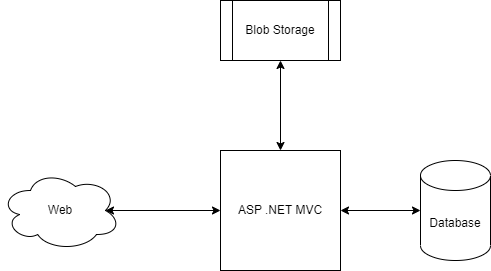

[![Version]]https://img.shields.io/badge/.NET-v6.0-blue

# TechChallenge01 - ImageUploaderMVC

O Tech Challenge 01 engloba o desenvolvimento de uma aplicação web com acesso ao banco de dados SQL Server Azure e ao Azure blob storage. O projeto em si contém uma aplicação Web desenvolvida em ASP.NET MVC servindo o front e backend da aplicação, na qual, fará a comunicação com o banco de dados e blob. Na aplicação Web é possível
adicionar imagens que serão armazenadas no Azure blob Storage e suas referencias (URL e Nome) serão guardados no banco de dados SQL Azure.


Abaixo é possível verificar a arquitetura da Applicação


O Design do banco de dados:


 ## Aplicação rodando
 
O Projeto ImageUpload se parece com a figura seguinte:



Na página inicial, o usuário verá a lista de todas as imagens guardas no blob store e algumas de suas propriedades como Nome, Descrição e URL.
Nesta página é permitido adicionar, deletar, modificar e ver detalhes de uma determinada imagem.

Caso o usuário queira adicionar uma imagem basta selecionar o botão CREATE e colocar todos os dados requeridos conforme a imagem abaixo:


### Configuração do Azure
1. Para configurar a infraestrutura do Azure (BlobStorage, SQL Server Azure e WebApp) foi criado dois scripts .bat para serem rodados.
1. Primeiramente, rode o script `DeployAzureInfra.bat`, na qual será a responsável por criar toda a infraestrutura no azure para a aplicação rodar.
1. Caso não haja nenhum erro, será necessário atualizar as Connection Strings em `appsettings.json`.
    Substitua o parâmetro `<SQL_DB_AZURE_CONNECTION_STRING>` pela sua connection string do SQL Azure DB.
    ```
    "ConnectionStrings": {
      "SqlConnection": "<SQL_DB_AZURE_CONNECTION_STRING>"
    },
    ```
    
    Depois, Substitua o parâmetro `<BLOB_STORAGE_AZURE_CONNECTION_STRING>`
    ```
    "AzureStorage": {
      "ConnectionString": "<BLOB_STORAGE_AZURE_CONNECTION_STRING>",
      "ContainerName": "image-container"
    }
    ```
### Upload da aplicação no Azure
1. Para fazer o upload da aplicação da aplicação no WebApp do Azure basta rodar o script `DeployApplication.bat`

    __NOTA__: Caso ocorra o erro seguinte durante o carregamento da aplicação no webapp. 
    ```
    HTTPSConnectionPool(host='caiomello-techchallenge01.scm.azurewebsites.net', port=443): Max retries exceeded with url: /api/zipdeploy?isAsync=true (Caused by SSLError(SSLCertVerificationError(1, '[SSL: CERTIFICATE_VERIFY_FAILED] certificate verify failed: unable to get local issuer certificate (_ssl.c:997)')))
    ```
    Pode ser que seu computador está atrás de um firewall corporativo o proxy corporativo. Com isso pode ocorrer uma falha de conexão SSL durante a checagem do certificado.
    Para Bypassar esse erro, a seguinte variavel de ambiemte pode ser adionada no computar `AZURE_CLI_DISABLE_CONNECTION_VERIFICATION=1`.
    
2. Caso tudo ocorra bem, a aplicação já estará disponível para conexão no endereço disponível no Azure WebApp.